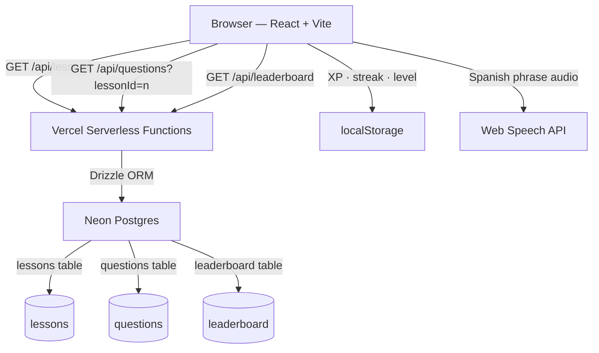
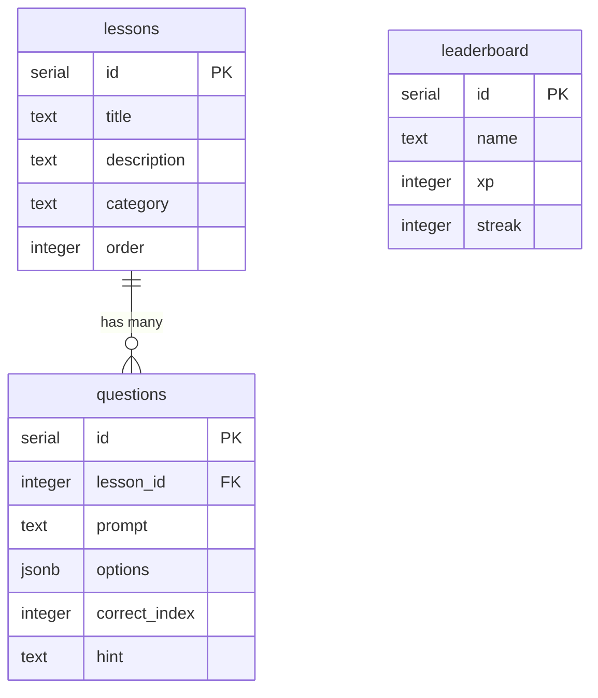

# Lingo

A gamified Spanish flashcard app built with React, TypeScript, and Neon Postgres. Features a full quiz loop with XP, streaks, hearts, a leaderboard, and Web Speech API audio.

**Live demo:** https://lingo.theteecee.dev

---

## Screenshots

| Home                                | Quiz                                                  | Complete                                        |
| ----------------------------------- | ----------------------------------------------------- | ----------------------------------------------- |
| Lesson card grid with category tags | 4-option multiple choice with hearts and progress bar | XP earned, accuracy, streak, and level progress |

---

## Features

- Multiple choice quiz loop with 4 options per question
- Hearts system — lose a heart on each wrong answer, lesson ends at 0
- XP and streak tracking persisted to localStorage
- Level progression (500 XP per level)
- Web Speech API audio — hear each Spanish phrase spoken aloud
- Leaderboard with seeded entries and your live rank
- Progress screen with level milestones
- Questions shuffled on every attempt so retrying feels fresh
- Time-aware greeting (good morning / afternoon / evening)
- XP pill animates in the nav when you earn points

---

## Tech stack

| Layer       | Technology                       |
| ----------- | -------------------------------- |
| Frontend    | React 18, TypeScript, Vite       |
| Styling     | Tailwind CSS v4                  |
| Routing     | React Router v6                  |
| Icons       | Lucide React                     |
| Database    | Neon Postgres (serverless)       |
| ORM         | Drizzle ORM                      |
| API         | Vercel serverless functions      |
| Deployment  | Vercel                           |
| Audio       | Web Speech API (browser-native)  |
| Persistence | localStorage (XP, streak, level) |

---

## Architecture



---

## Database schema



---

## Project structure

```
lingo/
├── api/                        # Vercel serverless functions
│   ├── lessons.ts              # GET /api/lessons
│   ├── questions.ts            # GET /api/questions?lessonId=n
│   └── leaderboard.ts          # GET /api/leaderboard
├── src/
│   ├── components/
│   │   └── TopNav.tsx          # Persistent nav with XP + streak pills
│   ├── hooks/
│   │   └── useUserStats.ts     # XP, streak, level logic + localStorage
│   ├── lib/
│   │   ├── db.ts               # Neon + Drizzle connection
│   │   ├── schema.ts           # Drizzle table definitions
│   │   └── seed.ts             # Seed script for lessons, questions, leaderboard
│   ├── screens/
│   │   ├── HomeScreen.tsx      # Lesson card grid
│   │   ├── QuizScreen.tsx      # Quiz loop with hearts and right panel
│   │   ├── CompleteScreen.tsx  # Post-lesson summary
│   │   ├── LeaderboardScreen.tsx
│   │   └── ProgressScreen.tsx
│   └── types/
│       └── index.ts            # Shared TypeScript interfaces
├── drizzle.config.ts
├── vercel.json
└── vite.config.ts
```

---

## Getting started

### Prerequisites

- Node.js 18+
- A [Neon](https://neon.tech) Postgres database

### Installation

```bash
git clone https://github.com/terrence-celestine/lingo.git
cd lingo
npm install
```

### Environment variables

Create a `.env` file at the root:

```
DATABASE_URL=your_neon_connection_string
```

### Database setup

Push the schema and seed the database:

```bash
npx drizzle-kit push
npm run seed
```

### Run locally

```bash
npx vercel dev
```

Visit `http://localhost:3000`.

---

## Engineering decisions

**Neon Postgres + Drizzle over a JSON file**
Question data lives in a real database rather than a hardcoded file. This makes it straightforward to add new lessons, languages, or question types without touching application code — just seed new rows.

**Vercel serverless functions over a separate Express server**
Keeping the API co-located with the frontend in a single Vercel project simplifies deployment significantly. There's no separate server to manage or keep running. The tradeoff is cold starts on the free tier, which are acceptable for a demo but worth revisiting at scale.

**localStorage over a users table**
XP, streak, and level are stored client-side rather than in the database. For a single-player demo this is the right call — it avoids needing auth entirely and keeps the architecture simple. A natural v2 would add Clerk auth and sync stats server-side to support the leaderboard with real user scores.

**Shuffle on every attempt**
Questions are shuffled on each quiz attempt so retrying a lesson feels fresh rather than memorizable. The shuffle happens client-side after the fetch, keeping the API simple.

**Web Speech API over a third-party TTS service**
Browser-native speech synthesis is free, requires no API key, and works offline. The voice quality varies by OS and browser but is more than sufficient for a learning app at this stage.

---

## Roadmap

- [ ] Keyboard shortcuts (1–4 to select, Enter to advance)
- [ ] Wrong answers review after lesson complete
- [ ] Lesson lock/unlock progression
- [ ] Confetti on lesson complete
- [ ] Settings page with progress reset
- [ ] Clerk auth + server-side XP sync
- [ ] Additional languages (French, Japanese)
