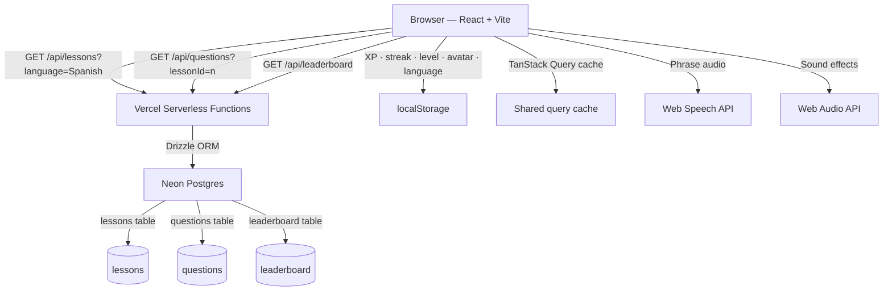
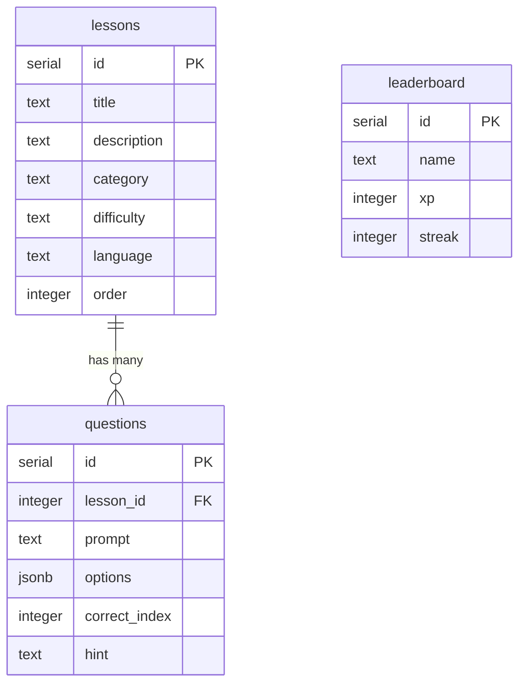

# Lingo

A gamified language learning app built with React, TypeScript, and Neon Postgres. Features a full quiz loop with XP, streaks, hearts, a leaderboard, sound effects, and Web Speech API audio — built in a single day.

**Live demo:** https://lingo.theteecee.dev

---

## Features

- 🇪🇸 Spanish and 🇫🇷 French language support — switch between languages on the home screen
- 28 lessons across 9 categories with difficulty badges (Beginner / Intermediate / Advanced)
- Lesson lock/unlock progression — complete lessons in order to unlock the next
- Multiple choice quiz loop with 4 options per question
- Hearts system — lose a heart on each wrong answer, lesson ends at 0
- Keyboard shortcuts — press 1–4 to select an answer, Enter to advance
- Web Speech API audio — hear each phrase spoken aloud in the correct language
- Sound effects for correct answers, wrong answers, lesson complete, level up, and failed lesson
- Wrong answers review screen after each lesson
- XP and streak tracking persisted to localStorage
- Streak freeze mechanic — automatically applied if you miss a day, earned by leveling up
- Level progression (500 XP per level) with a progress bar
- Leaderboard with seeded entries and your live rank
- Progress screen with level milestones and freeze count
- Settings modal — choose an avatar, set a display name, reset progress
- Next lesson button on complete screen — jump straight into the next lesson
- Questions shuffled on every attempt so retrying feels fresh
- Time-aware greeting (good morning / afternoon / evening)
- Loading skeletons on all data-fetching screens
- Error states with retry on all screens
- Page transitions with Framer Motion
- Responsive layout — desktop three-column view, mobile bottom tab bar
- Confetti burst on lesson complete

---

## Tech stack

| Layer         | Technology                                         |
| ------------- | -------------------------------------------------- |
| Frontend      | React 18, TypeScript, Vite                         |
| Styling       | Tailwind CSS v4                                    |
| Routing       | React Router v6                                    |
| Data fetching | TanStack Query v5                                  |
| Animations    | Framer Motion                                      |
| Icons         | Lucide React                                       |
| Database      | Neon Postgres (serverless)                         |
| ORM           | Drizzle ORM                                        |
| API           | Vercel serverless functions                        |
| Deployment    | Vercel                                             |
| Audio         | Web Speech API + Web Audio API (browser-native)    |
| State         | React Context (user stats + language)              |
| Persistence   | localStorage (XP, streak, level, avatar, language) |

---

## Architecture



---

## Database schema



---

## Project structure

```
lingo/
├── api/                              # Vercel serverless functions
│   ├── lessons.ts                    # GET /api/lessons?language=n
│   ├── questions.ts                  # GET /api/questions?lessonId=n
│   └── leaderboard.ts                # GET /api/leaderboard
├── src/
│   ├── components/
│   │   ├── AppLayout.tsx             # Shared layout — TopNav + BottomNav + children
│   │   ├── TopNav.tsx                # Desktop nav with XP, streak, freeze, settings modal
│   │   ├── BottomNav.tsx             # Mobile bottom tab bar
│   │   ├── PageTransition.tsx        # Framer Motion fade wrapper
│   │   └── ErrorState.tsx            # Reusable error + retry component
│   ├── context/
│   │   └── UserStatsContext.tsx      # React Context for XP, streak, level, avatar, language
│   ├── lib/
│   │   ├── db.ts                     # Neon + Drizzle connection
│   │   ├── schema.ts                 # Drizzle table definitions
│   │   ├── queries.ts                # TanStack Query query factories
│   │   ├── sounds.ts                 # Web Audio API sound effects
│   │   ├── seed.ts                   # Initial seed (3 Spanish lessons)
│   │   ├── seed-more.ts              # Extended seed (25 Spanish lessons)
│   │   └── seed-french.ts            # French seed (3 French lessons)
│   ├── screens/
│   │   ├── HomeScreen.tsx            # Lesson grid with language selector + lock/unlock states
│   │   ├── QuizScreen.tsx            # Quiz loop with hearts, progress bar, right panel
│   │   ├── CompleteScreen.tsx        # Post-lesson summary with confetti + next lesson
│   │   ├── ReviewScreen.tsx          # Wrong answers review
│   │   ├── LeaderboardScreen.tsx     # Weekly XP leaderboard
│   │   ├── ProgressScreen.tsx        # Level milestones, stats, and freeze count
│   │   └── SettingsScreen.tsx        # Avatar, display name, progress reset
│   └── types/
│       └── index.ts                  # Shared TypeScript interfaces
├── drizzle.config.ts
├── vercel.json
└── vite.config.ts
```

---

## Getting started

### Prerequisites

- Node.js 18+
- A [Neon](https://neon.tech) Postgres database

### Installation

```bash
git clone https://github.com/terrence-celestine/lingo.git
cd lingo
npm install
```

### Environment variables

Create a `.env` file at the root:

```
DATABASE_URL=your_neon_connection_string
```

### Database setup

Push the schema and seed the database:

```bash
npx drizzle-kit push
npm run seed
npm run seed:more
npm run seed:french
```

### Run locally

```bash
npx vercel dev
```

Visit `http://localhost:3000`.

---

## Engineering decisions

**TanStack Query over manual useEffect fetching**
Initially used `useEffect` + `useState` for data fetching, but this caused a double-render bug on the quiz screen where questions were shuffled twice and the wrong question displayed. Refactoring to TanStack Query eliminated the issue via request deduplication, gave shared caching across screens (the leaderboard is fetched once and reused on both the quiz screen and leaderboard screen), and provided loading and error states out of the box.

**React Context over prop drilling**
User stats (XP, streak, level, avatar, language) are consumed by multiple components at different levels of the tree — TopNav, QuizScreen, CompleteScreen, ProgressScreen, and SettingsScreen. Initially threaded stats as props but refactored to a single `UserStatsContext` so any component can access and mutate state without threading props through the tree.

**Multi-language architecture**
Language is stored in localStorage and passed as a query parameter to `/api/lessons?language=Spanish`. The API filters by language server-side so the client never sees lessons from other languages. Adding a new language requires only a seed file — no schema changes, no API changes, no frontend changes beyond adding it to the selector array. French and Spanish share the same question schema, with the Web Speech API lang switching to `fr-FR` automatically when French is active.

**Neon Postgres + Drizzle over a JSON file**
Question data lives in a real database rather than a hardcoded file. This makes it straightforward to add new lessons, languages, or question types without touching application code — just seed new rows. The `difficulty` and `language` columns were added via schema migrations mid-build to demonstrate the pattern.

**Vercel serverless functions over a separate Express server**
Keeping the API co-located with the frontend in a single Vercel project simplifies deployment significantly. There's no separate server to manage or keep running. The tradeoff is cold starts on the free tier, which are acceptable for a demo but worth revisiting at scale.

**localStorage over a users table**
XP, streak, level, avatar, language preference, and completed lessons are stored client-side. For a demo this avoids needing auth entirely and keeps the architecture simple. A natural v2 would add Clerk auth and sync stats server-side to enable a real leaderboard with live user scores and per-language streak tracking.

**Web Audio API over a third-party sound library**
Browser-native audio synthesis is free, requires no external files or API keys, and gives precise control over tone, frequency, and envelope. The correct answer chime, wrong answer thud, failed lesson descent, and lesson complete chord are all generated programmatically rather than loaded as audio files.

**Streak freeze auto-apply**
Rather than requiring users to manually activate a freeze before missing a day (which requires planning ahead), the freeze is applied automatically when the system detects a one-day gap in activity. This is more forgiving UX and mirrors how Duolingo's streak society feature works. Freezes are earned on level up to incentivize consistent XP accumulation rather than being given freely.

**AppLayout for shared chrome**
TopNav, BottomNav, and page transitions are handled in a single `AppLayout` component that wraps all routes. This means each screen only renders its own content — no repeated nav imports across 7 screen files.

---

## Roadmap

- [ ] Clerk auth + server-side XP sync for real leaderboard scores
- [ ] Per-language streak tracking
- [ ] Additional languages (Japanese, German, Portuguese)
- [ ] Spaced repetition algorithm for question ordering
- [ ] Offline support via service worker
- [ ] Push notifications for streak reminders
- [ ] Animated mascot character
